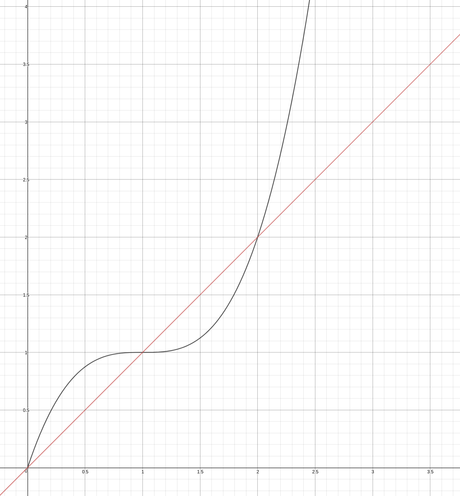

# Parabolic Filter Difficulty Adjustment

The difficulty adjustment algorithm implemented on the testnet, which can be found [here](../blockchain/difficulty.go) uses a simple cubic binomial formula that generates a variance against a straight linear multiplication of the average divergence from target that has a relatively wide, flat area that acts as a trap due to the minimal adjustment it computes within the centre 1/3, approximately, though as can be seen it is a little sharper above 1 than below:

The formula is as follows:

The data used for adjustment is the timestamps of the most recent block of an algorithm, and a fixed averaging window, which will initially be set at approximately 5 days (1440 blocks). Weighting, removing outliers, and other techniques were considered, but due to the fact that this essentially both a fuzzy logic control system, and being a poisson point process, it has been decided that for the first hard fork, as proven in initial testing, is already far superior to the previous mechanism that captures the most recent 10 blocks of a given algorithm, independently.

The performance of the original continuous difficulty adjustment system is very problematic. It settles into a very wide variance, with clusters of short blocks followed by very long gaps. It is further destabilised by wide variance of network hashpower, and the red line in the chart above roughly illustrates the variance/response that currently exists, though it fails even to work as well as a simple variance of the target directly by multiplying the divergence ratio by the previous difficulty, even with only one algorithm running, on a loopback testnet.

## The problems of existing difficulty adjustment regimes

Different cryptocurrencies have implemented a wide variety of difficulty adjustment schemes, generally the older coins with a bigger miner userbase have simpler, not even continuous adjusting, bitcoin simply makes an adjustment every 2016 (2 weeks) blocks. This kind of strategy is adequate in the case of a relatively stable hashrate on the network, but increasingly miners are using automated systems to mine the most profitable/and/or/easy (difficulty) coins instead, which often leads to even more volatile hashrates and consequent stress testing of the difficulty adjustments.

### Aliasing, the number one problem

The biggest problem with difficulty adjustment systems tends to be based on the low precision of the block timestamps, the low effective difficulty targeting precision, and due to the square-edged stair-step nature of such coarse resolution, is very vulnerable to falling into resonance feedback as the sharp harmonics implicitly existing in a coarse sampling system can rapidly get caught in wildly incorrect adjustments.

The fundamental fact is that what we call 'square' in mathematics is in fact literally infinite exponents. You can see this very easily by simply plotting y=xn curves with large values of `n`. In an adjustment, the calculation can jump dramatically between one point and the next in the grid, and then it can trigger resonances built from common factors in the coarse granuality, sending difficulty either up or down far beyond the change in actual hashrate.

The problem grows worse and worse as you try to reduce the block time, and then further compounding the dysregulation, random network latency, partitioning and partial partitioning such as near-partitioning can cause parts of the network to desynchronise dramatically, and the resonant cascades are fed with further fluctuating changes in latency, leading to high levels of orphan blocks, inaccurate adjustments, and dwells on outlying edges of the normal of the target.

For this, the difficulty adjustment flips the last two bits of the compressed 'bits' value. This is not an excessive variance, and basically tends to 'wiggle the tail' of the adjustments so that they are far less likely to fall into dwell points and go nonlinear. Because it is deterministic, all nodes can easily agree on the correct value based on a block timestamp and previous block difficulty target, but the result, like the source data, is stochastic, which helps eliminate the effects of aliasing distortion.

### Parabolic response curve

Most proof of work difficulty adjustment regimes use linear functions to find the target created in a block for the next block to hit. This geometry implicitly creates increasing instability because of the aliasing, as an angular edge, as mentioned before, has very high harmonics (power/parabolic function with a high index). So in this algorithm we use the nice, smooth cubic binomial as shown above, which basically adjusts the difficulty less the closer it is to target.

The area has to be reasonably wide, but not too wide. The constant linear adjustment caused by a linear averaging filter will cause this target to frequenntly be missed, and most often resulting in a periodic variance that never really gets satisfactorily close to keeping the block time stable.

But the worst part of a linear adjustment is that its intrinsic harmonics, created by granularity and aliasing, provide an attack surface for hashrate based attacks.

So the parabolic filter adjustment will instead converge slowly, and because of the dithering of the lowest bits of the difficulty target, it will usually avoid dwell points and compounding of common factors. The dithering also helps make it so that as the divergence starts to grow, if hashrate has significantly changed, its stochastic nature will make it more possible for the adjustment to more rapidly adjust.

## Conclusion

By adding a small amount of extra noise to the computations, we diminish the effect of common factors leading to dwells and sharp variation, and when wide variance occurs, the curve increases the attack of the adjustment in proportion, smoothly, with the width of the divergence.

The issue of difficulty adjustment becomes a bigger and bigger problem for Proof of Work blockchains the greater the amount of available hashpower becomes. Chains that are on the margins of hashrate distribution between chains are more and more vulnerable to 51% attacks and more sophisticated timing based attacks that usually aim to freeze the clock in a high work side chain that passes the chain tip.

These issues are a huge problem and the only solution can be, without abandoning the anti-spam proof of work system altogether, to improve the defences against the various attacks. Eliminating resonances is a big part of this, as they often are the easiest way to lower the real hashpower requuired to launch a 51% attack.

Further techniques, which will become more relevant with a higher transaction volume, is to diminish the incentive for very large miners to gobble up all the available transactions far outside of the normal, leaving the rest of the miners, of which many are loyal to a coin, out of pocket.

The withholding attack on pools is another issue, and part of the solution with this lies in ensuring that transactions are more spread out in their placement in blocks, the way that this will be done is inspired by the ideas in Freshcoin, which raises difficulty target along with the block weight.

Another approach that will be explored is low reward minimum difficulty blocks. These are tricky to implement in a live network with a lot of miners because of the problem of network synchronisation. The solution would seem to lie in setting a boundary but making it fuzzy enough that these blocks do not cause large numbers of orphans. The other problem with this is to do with block timestamp based attacks. So for this reason, such changes will be put off for future exploration.
